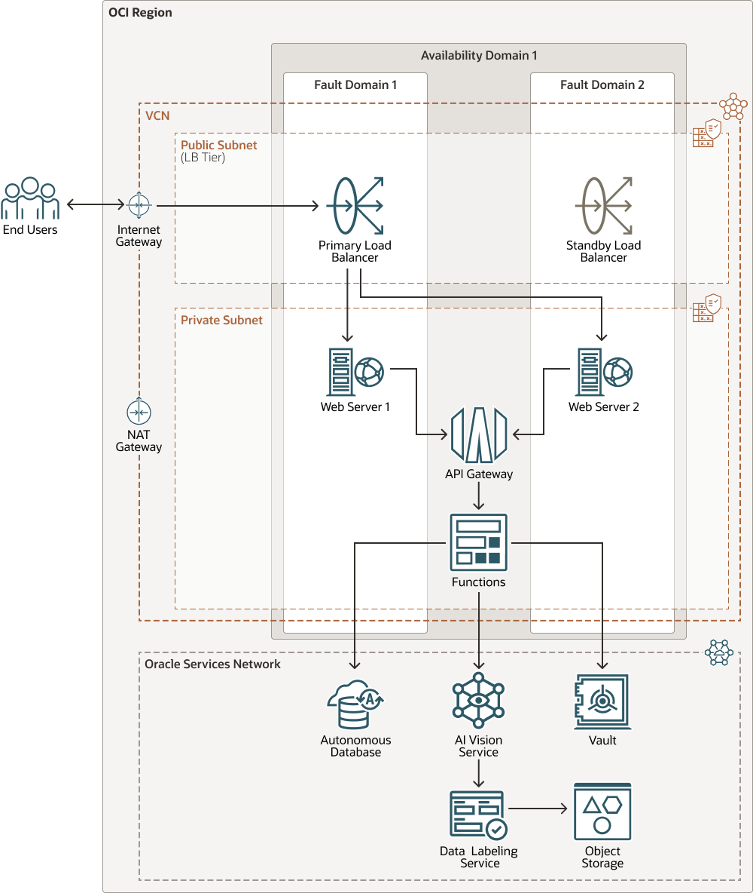

# oci-tf-vision-web-client

[](https://img.shields.io/badge/license-UPL-green) [](https://sonarcloud.io/dashboard?id=oracle-devrel_oci-tf-vision-web-client)

## Introduction
This is a terraform script that will create a set of resources on OCI that will help you to test an already existing vision model.

The scripts will generate a web app that uses the mobile camera to take pictures on whatever you want, and it has a button to analyze the content of the photograph and show the response of the vision service and some details that are saved on an autonomous JSON database.

The terraform script well generate the next assets in your tenant.

- An Autonomous database to save details of the detected objects on the image.
- A vault service to save the passwords safely in OCI
- The vision service and optionally a custom model using the data labeling service.
- A python serverless function to call the vision service and the database.
- An API gateway to expose the function.
- Two compute instances as web servers of the app.
- A load balancer on top of the instances to serve the page.



### Prerequisites
You need to have **docker** installed and of course **terraform** to run the scripts.

## Configuration

1. Clone this repository (it has a submodule so you need to clone recursive)

```
git clone https://github.com/carlgira-oracle/oci-tf-vision-web-client
```

2. Install the OCI-cli and configure a default profile. You can follow this instructions https://medium.com/@carlgira/install-oci-cli-and-configure-a-default-profile-802cc61abd4f

3. Create an Auth token for your user. (you are going to need it for pushing the function image to OCI registry). https://docs.oracle.com/en-us/iaas/Content/Registry/Tasks/registrygettingauthtoken.htm

4. Create the certificates for the load balancer and the private keys for the compute instances.
```
sh create_self_signed_certificate.sh
```

5. Set some variables.

- Required variables, tenancy_ocid and the comparment_ocid of the comparment where all the resources are going to be created also the model_id of the custom vision model.
```
export TF_VAR_tenancy_ocid=<>
export TF_VAR_compartment_ocid=<>
export TF_VAR_model_id=<>
```

During the execution of the script it will ask for two more variables, to log into the OCI registry.

- **ocir_user_name:** The full username of your OCI account (<namespace>/username).
- **ocir_user_auth_token:** Auth token created in the previous step.

6. Create dynamic groups.

- Dynamic group to select the API gateway resources in the work comparment

**api-gtw-dg**
```
ALL {resource.type = 'ApiGateway', resource.compartment.id = 'ocid1.compartment.xxx'}
```
- Dynamic group to select the functions resources in the work comparment

**functions-dg**
```
ALL {resource.type = 'fnfunc', resource.compartment.id = 'ocid1.compartment.xxx'}
```

7. Add policies, into the parent comparment.

- Add policies so funtions have access to the vision service and the vault service
```
allow dynamic-group functions-dg to use ai-service-vision-family in compartment <comparment_name>
allow dynamic-group functions-dg to use secret-family in compartment <comparment_name>
```

- Add policy so api gateway can call the function
```
allow dynamic-group api-gtw-dg to use functions-family in compartment <comparment_name>
```

## Build
Finally check the plan of terraform and apply it.

```
terraform init
terraform plan
terraform apply
```

## Output
The script will print on screen some variables so you can access the services.

- ssh commands to access the bastion and the webservers.
- User and password to access the database.
- The endpoint in the load balancer where the app is being served.

## Execute sql script on database
After the script finish you must connect to the database manually to exectute the script *init_script.sql*. It create the records of the labels you want the aplication to show. *Customize this files as you want.*

## Testing

After the script completes it will it will take 1 minute until de load balancer is active. At the end, terraform will print the load balancer url so you can access the application. 

*Remember that the first time the function is called, it needs time to warm up (it could take from 30 seconds to 1 minute), after that, all next requests should go very fast)*

## Destroy
If you want to delete all the resources. 
```
terraform destroy
```

## Contributing
This project is open source.  Please submit your contributions by forking this repository and submitting a pull request!  Oracle appreciates any contributions that are made by the open source community.

## License
Copyright (c) 2022 Oracle and/or its affiliates.

Licensed under the Universal Permissive License (UPL), Version 1.0.

See [LICENSE](LICENSE) for more details.

ORACLE AND ITS AFFILIATES DO NOT PROVIDE ANY WARRANTY WHATSOEVER, EXPRESS OR IMPLIED, FOR ANY SOFTWARE, MATERIAL OR CONTENT OF ANY KIND CONTAINED OR PRODUCED WITHIN THIS REPOSITORY, AND IN PARTICULAR SPECIFICALLY DISCLAIM ANY AND ALL IMPLIED WARRANTIES OF TITLE, NON-INFRINGEMENT, MERCHANTABILITY, AND FITNESS FOR A PARTICULAR PURPOSE.  FURTHERMORE, ORACLE AND ITS AFFILIATES DO NOT REPRESENT THAT ANY CUSTOMARY SECURITY REVIEW HAS BEEN PERFORMED WITH RESPECT TO ANY SOFTWARE, MATERIAL OR CONTENT CONTAINED OR PRODUCED WITHIN THIS REPOSITORY. IN ADDITION, AND WITHOUT LIMITING THE FOREGOING, THIRD PARTIES MAY HAVE POSTED SOFTWARE, MATERIAL OR CONTENT TO THIS REPOSITORY WITHOUT ANY REVIEW. USE AT YOUR OWN RISK. 